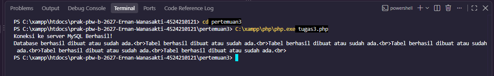
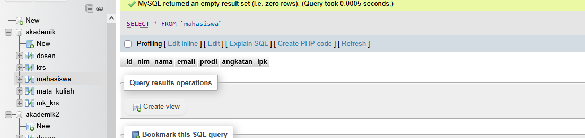
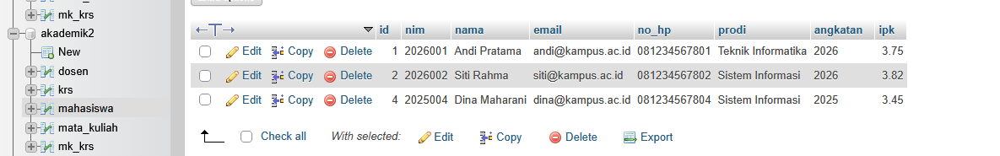
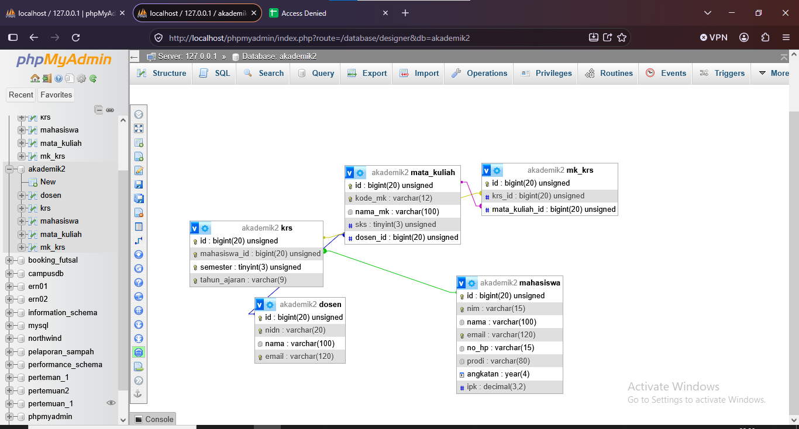

# TUGAS 3 - PERTEMUAN 3

## Identitas

**Nama:** Ernan Wanasakti
**NIM:** 4524210121
**Pertemuan:** 3

---

## 1. Tujuan

Tugas 3 dilakukan untuk menjalankan contoh program Pertemuan 3 menggunakan PHP dan MySQL hingga menghasilkan output tanpa error kritis. Selain menjalankan program, dilakukan modifikasi pada program dan database serta dilakukan pengamatan terhadap hasilnya melalui Terminal VS Code dan phpMyAdmin.

---

## 2. Hasil Pelaksanaan

Program berhasil dijalankan menggunakan PHP dan MySQL. Database yang digunakan pada hasil modifikasi adalah **akademik2**.

Database tersebut memiliki lima tabel, yaitu:

- `mahasiswa`
- `dosen`
- `mata_kuliah`
- `krs`
- `mk_krs`

Hasil running menunjukkan bahwa database dan seluruh tabel berhasil dibuat atau sudah tersedia.

### Dokumentasi Hasil Running



---

## 3. Modifikasi Program

Modifikasi yang dilakukan pada program meliputi:

### 3.1 Penambahan Field Nomor HP

Pada tabel `mahasiswa` ditambahkan field:

```sql
no_hp VARCHAR(15) NOT NULL
```

Penambahan ini bertujuan agar data mahasiswa memiliki informasi nomor HP.

### 3.2 Penambahan Validasi IPK

Pada tabel `mahasiswa` ditambahkan validasi:

```sql
CHECK (ipk >= 0.00 AND ipk <= 4.00)
```

Validasi tersebut digunakan untuk memastikan nilai IPK berada pada rentang 0.00 sampai 4.00.

### 3.3 Perubahan Nama Database

Database pada program awal yang menggunakan `akademik` diubah menjadi `akademik2`. Perubahan ini dilakukan agar hasil modifikasi memiliki database tersendiri dan tidak bercampur dengan database sebelumnya.

---

## 4. Perbandingan Sebelum dan Sesudah Modifikasi

Sebelum dilakukan modifikasi, tabel `mahasiswa` belum memiliki field `no_hp` dan belum memiliki validasi rentang nilai IPK.



Setelah dilakukan modifikasi, tabel `mahasiswa` memiliki tambahan field `no_hp` serta validasi nilai IPK 0.00 sampai 4.00.



---

## 5. Hasil Database

Setelah program berhasil dijalankan, database `akademik2` diperiksa melalui phpMyAdmin. Hasil pemeriksaan menunjukkan bahwa database berhasil dibuat dan memiliki lima tabel yang sesuai dengan program.



---

## 6. Lima Bagian Kode yang Penting

### 1. Koneksi Database

```php
require_once 'koneksi.php';
```

Bagian ini digunakan untuk menghubungkan program dengan konfigurasi koneksi MySQL.

### 2. Pembuatan Database

```php
$sqlCreateDB = "CREATE DATABASE IF NOT EXISTS akademik2";
```

Perintah tersebut digunakan untuk membuat database `akademik2` apabila database belum tersedia.

### 3. Pemilihan Database

```php
mysqli_select_db($koneksi, 'akademik2');
```

Perintah ini digunakan untuk memilih database `akademik2` sebagai database yang digunakan dalam proses pembuatan tabel.

### 4. Field Nomor HP

```sql
no_hp VARCHAR(15) NOT NULL
```

Field ini merupakan salah satu modifikasi yang ditambahkan pada tabel `mahasiswa` untuk menyimpan nomor HP.

### 5. Validasi IPK

```sql
CHECK (ipk >= 0.00 AND ipk <= 4.00)
```

Validasi ini digunakan untuk membatasi nilai IPK agar hanya berada pada rentang 0.00 sampai 4.00.

---

## 7. Error yang Pernah Muncul

Error yang ditemukan berkaitan dengan koneksi MySQL ketika MySQL pada XAMPP belum aktif. Kondisi tersebut menyebabkan program PHP tidak dapat terhubung dengan database.

Perbaikan dilakukan dengan mengaktifkan MySQL melalui XAMPP, kemudian menjalankan kembali program. Setelah MySQL aktif, program dapat dijalankan dengan baik dan database beserta tabel berhasil dibuat.

---

## 8. Kesimpulan

Berdasarkan hasil pelaksanaan, program Pertemuan 3 berhasil dijalankan menggunakan PHP dan MySQL tanpa error kritis. Database `akademik2` berhasil dibuat beserta lima tabel yang diperlukan.

Modifikasi yang dilakukan berupa penambahan field `no_hp`, validasi nilai IPK, dan perubahan nama database menjadi `akademik2`. Hasil modifikasi juga dapat diperiksa melalui phpMyAdmin dan menunjukkan bahwa struktur database telah sesuai dengan perubahan yang dilakukan.
