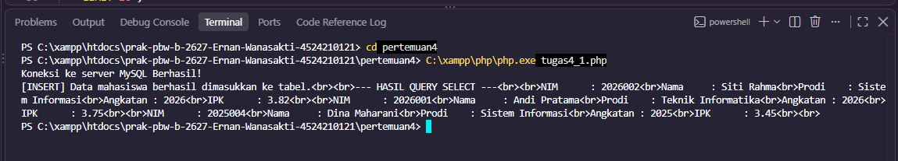
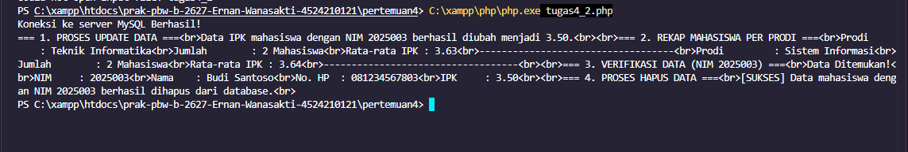
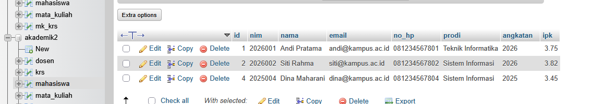

# TUGAS 4 - PERTEMUAN 4

## Identitas

**Nama:** Ernan Wanasakti
**NIM:** 4524210121
**Pertemuan:** 4

---

## 1. Tujuan

Tugas 4 dilakukan untuk menerapkan operasi dasar pengolahan data pada database MySQL menggunakan PHP. Tugas terdiri dari dua bagian, yaitu proses `INSERT` dan `SELECT` pada Tugas 4-1, serta proses `UPDATE`, `GROUP BY`, verifikasi data, dan `DELETE` pada Tugas 4-2.

---

# 2. Tugas 4-1

## Hasil Pelaksanaan

Pada Tugas 4-1 dilakukan proses memasukkan beberapa data mahasiswa ke dalam tabel `mahasiswa` menggunakan perintah `INSERT`. Setelah data berhasil dimasukkan, dilakukan proses `SELECT` untuk menampilkan mahasiswa yang memiliki IPK minimal 3.25.

Data yang ditampilkan diurutkan berdasarkan IPK dari yang tertinggi dan nama secara ascending. Hasil query juga dibatasi menggunakan `LIMIT 10`.

### Dokumentasi Hasil Running

> **Note foto:** Masukkan screenshot hasil running program Tugas 4-1 pada Terminal VS Code. Screenshot harus memperlihatkan pesan bahwa data mahasiswa berhasil dimasukkan dan hasil query `SELECT`.



## Bagian Kode Penting

### 1. INSERT Data

```php
$sqlInsert = "INSERT IGNORE INTO mahasiswa
(nim, nama, email, no_hp, prodi, angkatan, ipk) VALUES ...";
```

Perintah ini digunakan untuk memasukkan data mahasiswa ke dalam tabel `mahasiswa`.

### 2. SELECT Data

```php
$sqlSelect = "SELECT nim, nama, prodi, angkatan, ipk
FROM mahasiswa
WHERE ipk >= 3.25
ORDER BY ipk DESC, nama ASC
LIMIT 10";
```

Query tersebut digunakan untuk menampilkan mahasiswa dengan IPK minimal 3.25 dan mengurutkannya berdasarkan IPK serta nama.

---

# 3. Tugas 4-2

## Hasil Pelaksanaan

Pada Tugas 4-2 dilakukan beberapa operasi pengolahan data. Proses pertama adalah mengubah nilai IPK mahasiswa dengan NIM `2025003` menjadi 3.50 menggunakan `UPDATE`.

Selanjutnya dilakukan rekapitulasi jumlah mahasiswa dan rata-rata IPK berdasarkan program studi menggunakan `GROUP BY`. Program juga melakukan verifikasi terhadap data mahasiswa dengan NIM `2025003` sebelum data tersebut dihapus menggunakan `DELETE`.

### Dokumentasi Hasil Running

> **Note foto:** Masukkan screenshot hasil running program Tugas 4-2 pada Terminal VS Code. Screenshot sebaiknya memperlihatkan proses `UPDATE`, rekap mahasiswa per prodi, verifikasi data, dan proses `DELETE`.



## Bagian Kode Penting

### 1. UPDATE Data

```php
$sqlUpdate = "UPDATE mahasiswa
SET ipk = 3.50
WHERE nim = '2025003'";
```

Perintah ini digunakan untuk mengubah nilai IPK mahasiswa dengan NIM `2025003` menjadi 3.50.

### 2. GROUP BY dan AVG

```php
$sqlRekap = "SELECT prodi, COUNT(*) AS jumlah,
ROUND(AVG(ipk),2) AS rata_ipk
FROM mahasiswa
GROUP BY prodi
ORDER BY jumlah DESC";
```

Query tersebut digunakan untuk menghitung jumlah mahasiswa dan rata-rata IPK berdasarkan program studi.

### 3. Verifikasi Data

```php
$sqlVerifikasi = "SELECT * FROM mahasiswa
WHERE nim = '2025003'";
```

Bagian ini digunakan untuk memastikan data mahasiswa yang akan dihapus masih tersedia di dalam database.

### 4. DELETE Data

```php
$sqlDelete = "DELETE FROM mahasiswa
WHERE nim = '2025003'";
```

Perintah tersebut digunakan untuk menghapus data mahasiswa dengan NIM `2025003` setelah dilakukan verifikasi.

---

# 4. Hasil Database

Hasil dari kedua tugas dapat diperiksa melalui phpMyAdmin pada database `akademik2`, khususnya tabel `mahasiswa`.

Setelah proses `UPDATE` dan `DELETE` dijalankan, data pada tabel mengalami perubahan sesuai dengan perintah yang diberikan pada program.

> **Note foto:** Masukkan screenshot phpMyAdmin pada database `akademik2` → tabel `mahasiswa` → **Browse/Jelajahi**. Screenshot digunakan sebagai bukti kondisi data mahasiswa setelah program dijalankan.



---

# 5. Error yang Pernah Muncul

Error dapat terjadi apabila
